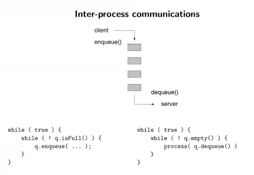

# Lecture 18

## Summary of Queues
- Queues are implemented with arrays or linked elements
- Modulo arithmetic is used when icrementing the index so that the queue wraps around the array when it reaches the end

```java
int index = (index+1) % MAX_QUEUE_SIZE;
```

## Asynchronous Processes
*Ansynchronous processing* means that the client and the server are not synchronized wich would occur if the server is not ready or cpapable of receiving the data at that time or speed. 

Example:
- The client inserts data into a queue (enqueue)
- The server removes data from the queue (dequeue) whenever it's ready for processing
- In this context, the queue is sometimes called a *buffer*



## Queue-Based Algos - Breadth First
Algorithm:
1. enqueue ""
2. while true
    a) s <- dequeue
    b) enqueue "s+0"
    c) enqueue "s+1"

This algo generates all the possible binary numbers: 0, 1, 00, 01, 10, 11, etc...

The generalization to sequences over any finite alphabet is trivial:

Take the arbirary alphabet {L, R U, D}

1. enqueue ""
2. while true
    a) s <- dequeue
    b) enqueue "s + L"
    c) enqueue "s + R"
    d) enqueue "s + U"
    e) enqueue "s + D"

## Maze Example
Let's say that each symbol of ths alphabet corresponds to a direction:

```
L = left
R = right
U = up
D = down
```

Each character in the string correspond to a path in a two dimensional plane

### Auxilary Methods
- Verifying that a path is valid: `checkPath(String path)`
- Has the exit been found? `reachesGoal(String path`

### Data Structures
A two dimensional array of characters:
```java
char[][] maze;
```

A position is not accessible (wall) if it contains a `"#"`, a cell is empty if `" "` and visited if `"+"`

Example:
```
#+#####
#+# # #
#++ # #
###   #
##### #
```

> Code sketch of `checkPath(String path)`
```java
private boolean checkPath(String path) {
    boolean[][] visited = new boolean [MAX_ROW][MAX_COL];
    int row, col;

    row = col = 0; // Assuming the enterance is found a (0, 0)

    int pos = 0;
    boolean valid = true;

    while (valid && pos < path.length>) {
        char direction = path.charAt(pos++);

        // Read the position and change the position coordinates
        switch (direction) {
            case LEFT:
                col--;
                break;
            case RIGHT:
                col++;
                break;
            case DOWN:
                row--;
                break;
            case UP:
                row++;
                break;
            default:
                valid = false;
        }

        // Check if the new position is valid
        if ((row >= 0) && (row < MAX_ROW) && (col < MAX_COL)) {
            // Recall that visited is a 2D array of booleans: if the element is false, that spot has not been analyzed
            if (visited[row][col] || grid[row][col] == WALL) {
                valid = false;
            } else {
                visited[row][col] = true;
            }
        }
    }

    return valid;
}
```

> Code sketch of `reachesGoal(String)`

```java
private boolean reachesGoal(String path) {
    int row = 0;
    int col = 0;
    for (int pos=0; pos < path.length(); pos++) {
        char direction = path.charAt(pos);
        switch (direction) {
            case LEFT: col--; break;
            case RIGHT: col++; break;
            case DOWN: row--; break;
            case UP: row++; break;
        }
    }

    return grid[row][col] == OUT;
}
```
