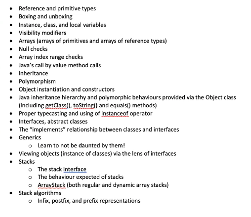

# Lecture 13

Exam Schedule:

- 10AM to 10:40AM (Part 1)
    - Brightspace quiz
    - Write multiple choice section (Part 1) and submit it
    - You must submit Part 1 BEFORE starting Part 2

- 10:40AM to 12PM (Part 2)
    - Brightspace assignemnt
    - Hour and twenty minutes to complete Part 2
    - Start Part 2 at 10:40 sharp
    - You can submit multiple times
    - only the last submission is kept

- 12PM to 12:15PM
    - Grace period
    - You can code during this time period, but late submissions are not allowed

> Today's lecture should all be review

## Midterm Review Topics

- Reference and primitive types
    - Reference types are data types who's address on the computer hold a reference to a reference type. Examples of refernce types are classes; arrays, strings, stacks, etc
    - Primitive types are data types that are stored directly in the memory slot they are assigned to. Examples of reference types are integers, booleans, floating point numbers, etc

- Boxing and unboxing
    - Boxing is a way to store a primitive data type as a reference type
    - Conversely, unboxing converts a reference type to a primitive type
    - An example of a "wrapper" (which is a class that boxes and unboxes) is the Integer class built into Java

- Instance, class and local variables
    - An instance variable is a variable that is created when the class is instanciated; they are often declared at the beginning of a class and initialized when the class is instanciated
    - Class variables are static, so all instances of a class can access a class variable
    - Local variables are variables that cannot be accessed outside the context of the class. Often they aer used for the innerworkings of various methods

- Visibility modifiers
    - Visibility modifiers control what data is available to outside classes
    Visibility modifiers are:
    - `private`, only methods inside the class can access private methods/variables
    - `default`, only classes in the same package can access default methods/variables
    - `protected`, only classes in the same package or children of the same package can access protected methods/variables
    - `public` any class can access a public method/variable

- Arrays
    - Indexed, unexpandable lists of a specified data type

- Null checks (*may not be on test*)

- Java's call by value method calls
    - Call by value simply means that the parameters are values
    - Conversely, call by reference method calls take in references as parameters, then the method manipulates the references

- Inheritance
    - Interitance the process by which a subclass inherits from a super class
    - When a class inherits from another, it gains all the methods of the parent (super) class

- Polymorphism
    - Polymorphism is where you can use methods from interited classes

- The Object class
    - Every class in java inherits from the Object class

- Stack algorithms
    - Infix to postfix representation

## Midterm Hints

- If the ArrayStack class is dynamic, the capacity constant is not initialized when the ArrayStack is instanciated

- The ArrayStack code in the exam is correct; do not use another Stack implementation

- jUnit will not be part of the midterm, instead sample test cases will be given directly in the starter code