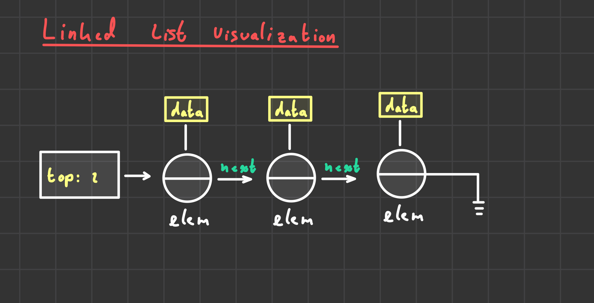

# Lecture 14

For far, an array has been the basis of our stack implementation. This is a bit clunky, because memory is wasted, or overflow happens.

## Linked Lists
Linked lists solve are more efficient; memory is not wasted. 

Linked lists link elements (nodes) to each other

